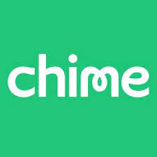

# Homework1

## Fintech casestudy of *Chime*

**Name of company-** 
Chime

**When was the company incorporated?-**
2013

**Who are the founders of the company?-**
Chris Britt(CEO) and Ryan King(CTO)

**How did the idea for the company (or project) come about?-** 
Chris Britt worked in payment for 10 years and saw how he could apply his knowledge to the consumer end of transactions

**How is the company funded? How much funding have they received?-** 
They raised money from VCs and instituional investors. Overall, they've recieved 2.6 Billion in funding

---
## Business Activities:
**What specific financial problem is the company or project trying to solve?-**
simplify banking for average Americans, and eliminating fees

**Who is the company's intended customer?  Is there any information about the market size of this set of customers?
What solution does this company offer that their competitors do not or cannot offer? (What is the unfair advantage they utilize?)-** 
Middle income consumers(Chime’s customers typically are late 20s early 30s, according to Britt. 166 million Americans. Their advantage is their lack of fees and lean business model

**Which technologies are they currently using, and how are they implementing them? (This may take a little bit of sleuthing–– you may want to search the company’s engineering blog or use sites like Stackshare to find this information.)-** 
react, TypeScript, ES6, React Native, Amazon S3, Amazon EC2, Ruby, Rails, Go, Amazon RDS, Elixir, Amazon Aurora, Snowflake, Amazon Athena, AWS Glue, Citus, graphql.js 

---

## Landscape:

**What domain of the financial industry is the company in?-**
The payment industry(ex. Square, Visa, mastercard)

**What have been the major trends and innovations of this domain over the last 5-10 years?-**
 Elimination of hidden fees, higher interest savings, real time account balances, Apple Pay, improved UI

**What are the other major companies in this domain?-**
PayPal, Venmo, cash app 

---

## Results

**What has been the business impact of this company so far?-** 
Larger banks now have apps and lowering fees in order to stay competitive

**What are some of the core metrics that companies in this domain use to measure success? How is your company performing, based on these metrics?-**
number of users accessing the payment gateway, # of users completing the payment, number of users storing payment/CC info for future use
number of users selecting the payment gateway on products having multiple payment gateways, and Total Revenue. Chime has millions of users utilizing their cards everyday and have more than doubled their market cap every year.

**How is your company performing relative to competitors in the same domain?-**
 Chime is considered the market leader 

---

## Recommendations

**If you were to advise the company, what products or services would you suggest they offer? (This could be something that a competitor offers, or use your imagination!)-**
 Money lending(from auto to unsecured)

**Why do you think that offering this product or service would benefit the company?-**
 Lending would, obviously, make them a lot of money, but also allow them to continue their mission of helping people who've traditionally been underserved by banks. 

**What technologies would this additional product or service utilize?-** In the beginning they might want to outsource and partner with a company like Infinitysoftware(link down below for their webpage), but eventually bring that in house.

**Why are these technologies appropriate for your solution?-**
They are an already established
 lending platform that would allow Chime to start making money ASAP, and when they generate enough capital they can create their own lending platform to use without any middlemen. The middleman would just be used to get things started.

---

## Resources

[link](https://www.crunchbase.com/organization/chime-2/company_financials)

[link](https://www.google.com/amp/s/www.brookings.edu/blog/the-avenue/2020/07/30/now-more-than-half-of-americans-are-millennials-or-younger/amp/)

[link](https://thefinancialbrand.com/106322/challenger-bank-chime-future-retail-banking-trend-mobile/
)

[link](https://stackshare.io/chime/chime)

[link](https://www.productmanagementexercises.com/3962/what-success-metrics-would-measure-payment-gateway-product)

[link](https://www.infinitysoftware.com/solutions#loan-type)

